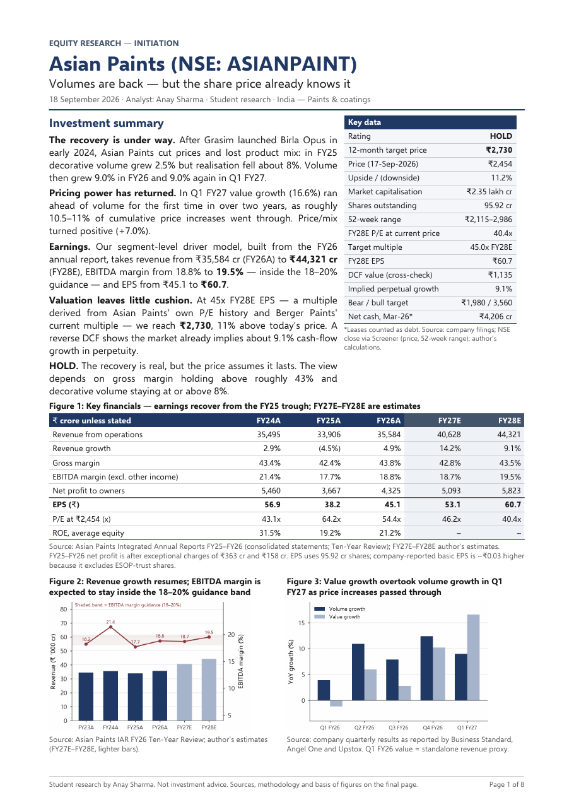
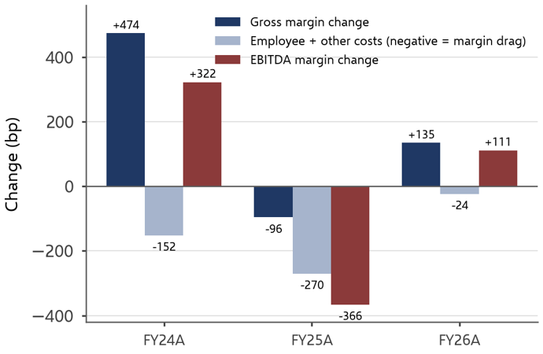
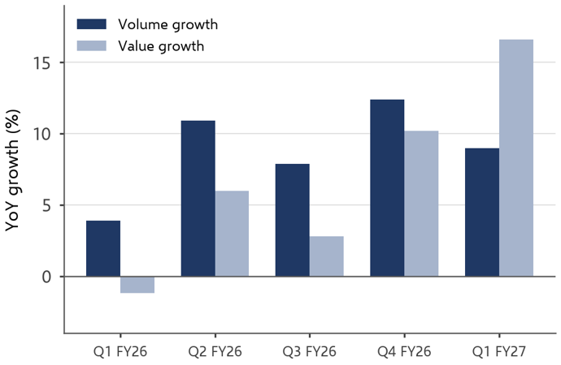
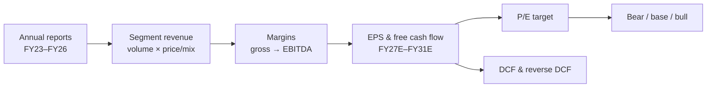

# Asian Paints (NSE: ASIANPAINT) — Equity Research Initiation

**Volumes are back — but the share price already knows it.**

An 8-page initiation note and the Excel model behind it. Built from Asian Paints' own annual reports, with every major number traced to its source.

| Rating | 12-month target | Price (17-Sep-2026) | Upside | FY28E EPS | FY28E P/E |
|:---:|:---:|:---:|:---:|:---:|:---:|
| **HOLD** | **₹2,730** | ₹2,454 | +11% | ₹60.7 | 40.4x |

**[Read the note (PDF)](Asian_Paints_Research_Note.pdf)** · **[Open the model (Excel)](Asian_Paints_Financial_Model.xlsx)**

---

## The call in 30 seconds

After Birla Opus entered decorative paints in 2024, Asian Paints spent two years buying volume with price. That phase has ended. Decorative volume grew 9% in FY26, and in Q1 FY27 value growth (16.6%) overtook volume (9.0%) for the first time in over two years.

The recovery is real, but the valuation already assumes it lasts. At 45x FY28E EPS the target is ₹2,730, only 11% above the current price. A reverse DCF shows the current price implies roughly **9% cash-flow growth in perpetuity**. Hence HOLD, not BUY.

## Three findings

**1. FY25 was a cost problem, not a raw-material problem.**
EBITDA margin fell 366bp, but gross margin fell only 96bp. The rest came from advertising, distribution and staff costs rising while revenue fell, as the company defended share.

**2. Pricing power returned in Q1 FY27.**
Price/mix was negative for three straight years, from (4%) to (8%). It turned +7% in Q1 FY27 as price increases passed on crude-linked inflation. The cost shows up in standalone gross margin, which fell 180bp from Q4.

**3. P/E and DCF disagree, and that disagreement is the point.**
P/E gives ₹2,730; a three-stage DCF gives ₹1,135. The note explains why the two methods differ and uses the gap to show how little margin of safety the stock has.

## What's inside

| File | Contents |
|---|---|
| [`Asian_Paints_Research_Note.pdf`](Asian_Paints_Research_Note.pdf) | 8 pages, 16 exhibits: investment summary, FY23–FY26 earnings bridge, driver tree, quarterly tracker, competition, forecast, valuation, scenarios, thesis breakers, sources |
| [`Asian_Paints_Financial_Model.xlsx`](Asian_Paints_Financial_Model.xlsx) | 15 sheets: assumptions log, historicals, segment revenue build, forecast to FY31E, three-stage DCF, P/E framework, bear/base/bull scenarios, 26 checks, source log |

## How the model works

- **Inputs live in one sheet.** Every forecast assumption sits on the `Assumptions` tab, with its historical reference, management guidance and rationale.
- **Colour conventions.** Blue = input, black = formula, green = link to another sheet.
- **Scenarios.** Changing a yellow cell flows through to the target price, scenarios and checks.

## Scenarios

| FY28E | Bear | Base | Bull |
|---|---:|---:|---:|
| Decorative volume growth | 5.0% | 8.0% | 10.0% |
| Gross margin | 42.0% | 43.5% | 44.4% |
| EPS | ₹49.5 | ₹60.7 | ₹68.5 |
| Target P/E | 40x | 45x | 52x |
| **Target price** | **₹1,980** | **₹2,730** | **₹3,560** |

## Data and verification

- **Primary sources.** FY24–FY26 historicals are taken from Asian Paints' audited consolidated statements (Integrated Annual Reports FY25 and FY26) and reconciled line by line. The workbook runs 26 reconciliation and integrity checks, and all of them pass.
- **Corrections.** Where aggregator data (Screener, MarketsMojo) disagreed with the filings, the filed figure was used. Examples: reported EPS, total assets, lease liabilities, investing cash flows.
- **Labelled basis.** Every figure is tagged as *reported*, *derived*, *management guidance*, *secondary source* or *analyst assumption*.
- **Still open.** FY23 balance-sheet lines, quarterly volume/margin figures against investor presentations, and peer data against their own filings. These are listed openly in the note rather than treated as verified.

## What would change the view

The note sets thresholds for the thesis breaking, taken from guidance and past results rather than chosen for effect. Examples: decorative volume below 8% for two quarters, price/mix turning negative again, or gross margin below the FY25 trough of 42.4%.

---

*Student research by Anay Sharma, September 2026. Prepared for learning purposes. Not investment advice.*
